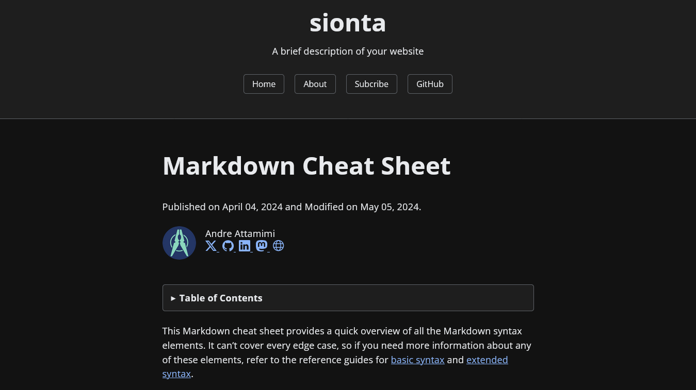

# Blog

Jekyll blogging theme.

## Features

- Responsive design
- Security headers (for Netlify hosting)
- Robots.txt
- Feed and Sitemap
- Compressed HTML and CSS
- SEO optimized (Twitter cards, Facebook Open Graph, Schema.org)
- Anchor headings
- Tags & tag pages
- Sidebar navigation
- Search blog
- 404 page
- Embed Youtube (comming soon)
- Comments ([Disqus](https://disqus.com/), [giscus](https://giscus.app/) and [utterances](https://utteranc.es/))
- Mathematics ([MathJax](https://www.mathjax.org/))
- Diagramming ([Mermaid](https://mermaid.js.org/))

## Screenshot

