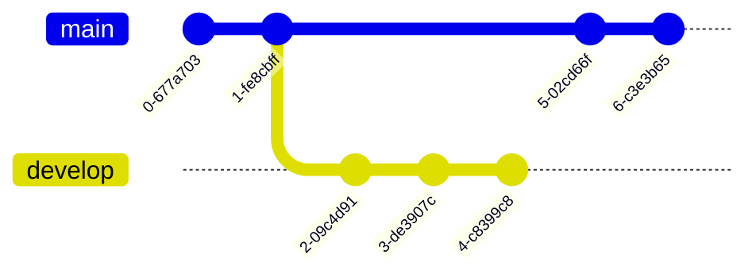

This Markdown cheat sheet provides a quick overview of all the Markdown syntax elements. It can’t cover every edge case, so if you need more information about any of these elements, refer to the reference guides for [basic syntax](https://www.markdownguide.org/basic-syntax/) and [extended syntax](https://www.markdownguide.org/extended-syntax/).

### Table of Contents
{:.no_toc}

* A markdown unordered list which will be replaced with the ToC, excluding the "Table of Contents" from above
{:toc}

## Headings

# Heading 1
{:.no_toc}
## Heading 2
{:.no_toc}
### Heading 3
{:.no_toc}

## Paragraph

Aliqua sunt aute fugiat velit amet quis excepteur consectetur ad ex eiusmod. Duis eiusmod amet nulla elit esse. Cupidatat laborum elit culpa in ex mollit consequat mollit in. Veniam fugiat dolore Lorem dolor anim id proident. Velit commodo consequat deserunt proident deserunt sunt sunt consequat sit excepteur.

Proident sint tempor adipisicing anim cupidatat consectetur dolor. Velit dolor eiusmod ex consequat consequat veniam elit duis consequat. Anim qui magna consectetur nulla in ex minim enim labore esse aliqua adipisicing dolor consectetur. Do nostrud dolore aute et mollit magna laboris commodo labore eiusmod consectetur excepteur. Lorem velit ad consequat consectetur eiusmod occaecat. Irure ut labore culpa est aliquip ut aute sint ea quis.

## Lists

### Ordered list

1. Firstly
2. Secondly
3. Thirdly

### Unordered list

- Chapter
  - Section
    - Paragraph

### ToDo list

- [ ] Jobs
  - [x] Step 1
  - [x] Step 2
  - [ ] Step 3

### Description list

Sun
: the star around which the earth orbits

Moon
: the natural satellite of the earth, visible by reflected light from the sun

## Block Quote

> This line shows the _block quote_.

## Prompts

> An example showing the `tip` type prompt.
{: .prompt-tip }

> An example showing the `info` type prompt.
{: .prompt-info }

> An example showing the `warning` type prompt.
{: .prompt-warning }

> An example showing the `danger` type prompt.
{: .prompt-danger }

## Tables

| Company                      | Contact          | Country |
| :--------------------------- | :--------------- | ------: |
| Alfreds Futterkiste          | Maria Anders     | Germany |
| Island Trading               | Helen Bennett    |      UK |
| Magazzini Alimentari Riuniti | Giovanni Rovelli |   Italy |

## Links

<http://127.0.0.1:4000>

## Footnote

Click the hook will locate the footnote[^footnote], and here is another footnote[^fn-nth-2].

## Inline code

This is an example of `Inline Code`.

## Filepath

Here is the `/path/to/the/file.extend`

## Code blocks

### Common

```plain
This is a common code snippet, without syntax highlight and line number.
```

### Specific Language

```python
# This program prints Hello, world!

print('Hello, world!')
```

## Mathematics

The mathematics powered by [**MathJax**](https://www.mathjax.org/):

When $$a \ne 0$$, there are two solutions to $$ ax^2 + bx + c = 0 $$ and they are $$x = {-b \pm \sqrt{b^2-4ac} \over 2a}.$$

## Diagramming

The powered by [**Mermaid**](https://mermaid.js.org/):



## Images


## Reverse Footnote

[^footnote]: The footnote source
[^fn-nth-2]: The 2nd footnote source
