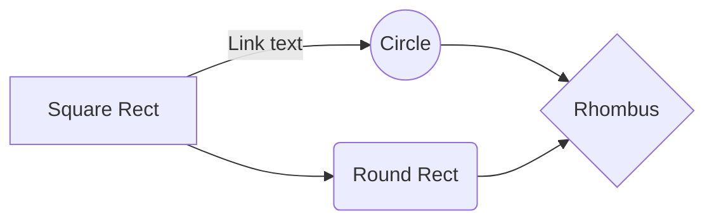

<!-- markdownlint-disable -->
<!-- https://www.markdownguide.org/hacks/ -->

<!-- {:.notice} -->
This Markdown cheat sheet provides a quick overview of all the Markdown syntax elements. It can’t cover every edge case, so if you need more information about any of these elements, refer to the reference guides for [basic syntax](https://www.markdownguide.org/basic-syntax/) and [extended syntax](https://www.markdownguide.org/extended-syntax/).

## Headings

# H1
{:.no_toc .no_anchor}

## H2
{:.no_toc .no_anchor}

### H3
{:.no_toc .no_anchor}

## Paragraphs

Elit ex ex eiusmod duis cupidatat duis esse laboris et sit reprehenderit eu. Elit sint nostrud ex reprehenderit fugiat do elit anim veniam nulla veniam amet. Nisi velit deserunt sunt excepteur irure ut ipsum excepteur minim. Et laborum minim elit laboris dolor in. Nisi sunt labore pariatur magna fugiat cupidatat qui quis consequat aliqua commodo. Dolor nisi veniam elit proident. Irure laboris tempor consectetur ad enim ea officia ullamco.

Officia aute duis pariatur magna occaecat duis culpa est veniam. Amet do ea nulla labore laboris irure consectetur. Ut nostrud sunt ipsum amet cupidatat ex quis cupidatat qui in anim culpa. Est velit voluptate reprehenderit eu ad commodo. Tempor laborum dolore velit est laboris.

## Emphasis

**bold text**

*italicized text*

**Bold** and *Italic*

~~strikethrough~~

## Lists

### Ordered List

1. First item
2. Second item
3. Third item
    1. Indented item
    2. Indented item
4. Fourth item

### Unordered List

- First item
- Second item
- Third item
  - Indented item
  - Indented item
- Fourth item

### Task List

- [x] Write the press release
- [ ] Update the website
- [ ] Contact the media

### Definition List

Sun
: The Sun is the star at the center of the Solar System.

Moon
: The Moon is the brightest celestial object in Earth's night sky.
: It orbits at an average distance of 384,400 km, about 30 times the diameter of Earth.

## Blockquotes

The blockquote element represents content that is quoted from another source, optionally with a citation which must be within a `footer` or `cite` element, and optionally with in-line changes such as annotations and abbreviations.

> "If you want to find the secrets of the universe, think in terms of energy, frequency, and vibration."
>
> <cite>&mdash; Nikola Tesla</cite>

## Codes

This is an inline: `code`

## Fenced Code Block

This is a code block without syntax highlighting:

```plain
{
  syntax, error,
  "firstName": "John",
  "lastName": "Smith",
  "age": 25
}
```

### Syntax Highlighting

To add syntax highlighting, specify a language next to the backticks before the fenced code block.

```json
{
  syntax, error,
  "firstName": "John",
  "lastName": "Smith",
  "age": 25
}
```


You can also add syntax highlighting by starting with `` and ending with ``. Replace 'LanguageCode' with the appropriate code language.

Example:
```plain

def print_hi(name)
  puts "Hi, #{name}"
end
print_hi('Tom')
# => prints 'Hi, Tom' to STDOUT.

```


Output:

def print_hi(name)
  puts "Hi, #{name}"
end
print_hi('Tom')
# => prints 'Hi, Tom' to STDOUT.


## Links

<https://github.com/sionta>

I love supporting the **[EFF](https://eff.org)**.
This is the *[Markdown Guide](https://www.markdownguide.org)*.
See the section on [`code`](#codes).

## Footnotes

Here's a simple footnote,[^1] and here's a longer one.[^bignote]

[^1]: This is the first footnote.

[^bignote]: Here's one with multiple paragraphs and code.

    Indent paragraphs to include them in the footnote.

    `{ my code }`

    Add as many paragraphs as you like.

## Images

<!--  -->

{:.image.left}

<!--  -->

{:.image.right}

<!--  -->

{:.image.center}

## Tables

To add a table, use three or more hyphens \(\-\-\-\) to create each column’s header, and use pipes \(\|\) to separate each column. For compatibility, you should also add a pipe on either end of the row.

| Syntax      | Description |
| ----------- | ----------- |
| Header      | Title       |
| Paragraph   | Text        |

You can align text in the columns to the left, right, or center by adding a colon (:) to the left, right, or on both side of the hyphens within the header row.

| Left      | Center | Right       |
| :---      | :----: | ---:        |
| Header    | Title  | Here's this |
| Paragraph | Text   | And more    |

## Horizontal Rule

---

## Alerts

> This is use `{:.alert}`.
{:.alert}

> This is use `{:.alert.info}`.
{:.alert.info}

> This is use `{:.alert.warning}`.
{:.alert.warning}

> This is use `{:.alert.danger}`.
{:.alert.danger}

> This is use `{:.alert.success}`.
{:.alert.success}

## Mathematics

The Mathematics Powered by [KaTeX:](https://katex.org/)

This is an inline formula: $$a^2 + b^2 = c^2$$.

This is a block formula:

$$
\int_0^\infty e^{-x} \, dx = 1.
$$

## Diagramming

The Diagramming and charting Powered by [Mermaid:](https://mermaid.js.org/)

This basic flowchart:



## Other Elements (sub, sup, and etc.)

### Highlight

I need to highlight these <mark>very important words</mark>.

### Subscript

Almost every developer's favorite molecule is C<sub>8</sub>H<sub>10</sub>N<sub>4</sub>O<sub>2</sub>, also known as "caffeine."

### Superscript

One of the most common equations in all of physics is <var>E</var>=<var>m</var><var>c</var><sup>2</sup>.

### Emoji Shortcodes

If you see :raised_hand: as an emoji it means Emoji Shortcodes are active, if not open terminal and run below:

```bash
echo 'gem "jemoji", "~> 0.13", group: :jekyll_plugins' >> Gemfile
bundle install

# Test or preview on locally
budle exec jekyll serve --livereload
```

> In most cases, you can simply copy an emoji from a source like [📙 Emojipedia](https://emojipedia.org/) and paste it into your document.

## Result Footnotes
