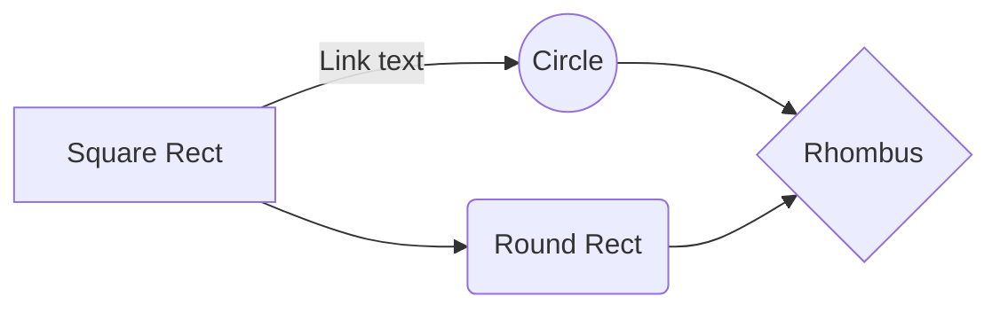

This Markdown cheat sheet provides a quick overview of all the Markdown syntax elements. It can’t cover every edge case, so if you need more information about any of these elements, refer to the reference guides for [basic syntax](https://www.markdownguide.org/basic-syntax/) and [extended syntax](https://www.markdownguide.org/extended-syntax/).

## Basic Syntax

### Heading

# H1

## H2

### H3

### Bold

**bold text**

### Italic

*italicized text*

### Blockquote

> blockquote

### Ordered List

1. First item
2. Second item
3. Third item

### Unordered List

- First item
- Second item
- Third item

### Code

`code`

### Link

[Markdown Guide](https://www.markdownguide.org)

### Image


### Horizontal Rule

---

## Extended Syntax

These elements extend the basic syntax by adding additional features. Not all Markdown applications support these elements.

### Table

| Syntax | Description |
| ----------- | ----------- |
| Header | Title |
| Paragraph | Text |

### Fenced Code Block

```c
// This is a comment
#include <stdio.h>

int main() {
  printf("Hello World!");
  return 0;
}
```

This is error in `json`:

```json
{
  syntax: error,
  "syntax": "good"
}
```

### Alerts

<!-- markdownlint-capture -->
<!-- markdownlint-disable -->
> An example showing the `info` type alert.
{: .alert-info }

> An example showing the `success` type alert.
{: .alert-success }

> An example showing the `warning` type alert.
{: .alert-warning }

> An example showing the `danger` type alert.
{: .alert-danger }
<!-- markdownlint-restore -->

### Footnote

Here's a sentence with a footnote. [^1]

[^1]: This is the footnote.

### Definition List

term
: definition

### Strikethrough

~~The world is flat.~~

### Task List

- [x] Write the press release
- [ ] Update the website
- [ ] Contact the media

### Emoji

That is so funny! :joy:

### Highlight

Most <mark>salamander</mark>s are nocturnal, and hunt for insects, worms, and other small creatures.

### Subscript

Almost every developer's favorite molecule is C<sub>8</sub>H<sub>10</sub>N<sub>4</sub>O<sub>2</sub>, also known as "caffeine."

### Superscript

One of the most common equations in all of physics is <var>E</var>=<var>m</var><var>c</var><sup>2</sup>.

### MathJax

When $$a \ne 0$$, there are two solutions to $$ ax^2 + bx + c = 0 $$ and they are $$x = {-b \pm \sqrt{b^2-4ac} \over 2a}.$$

### Mermaid



### Footnote links
