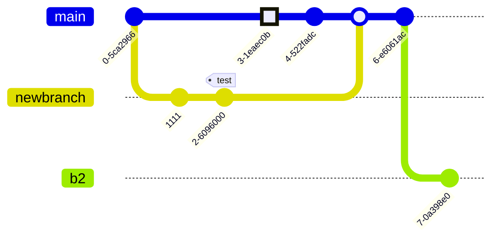

<!-- markdownlint-disable MD022 MD025 MD033 MD036 MD056 -->

This Markdown cheat sheet provides a quick overview of all the Markdown syntax elements. It can’t cover every edge case, so if you need more information about any of these elements, refer to the reference guides for [basic syntax](https://www.markdownguide.org/basic-syntax/) and [extended syntax](https://www.markdownguide.org/extended-syntax/).

## Basic Features

### Headings

# H1
{:.no_toc .no_anchor}
## H2
{:.no_toc .no_anchor}
### H3
{:.no_toc .no_anchor}

### Paragraphs

Elit ex ex eiusmod duis cupidatat duis esse laboris et sit reprehenderit eu. Elit sint nostrud ex reprehenderit fugiat do elit anim veniam nulla veniam amet. Nisi velit deserunt sunt excepteur irure ut ipsum excepteur minim.

Et laborum minim elit laboris dolor in. Nisi sunt labore pariatur magna fugiat cupidatat qui quis consequat aliqua commodo. Dolor nisi veniam elit proident. Irure laboris tempor consectetur ad enim ea officia ullamco.

Officia aute duis pariatur magna occaecat duis culpa est veniam. Amet do ea nulla labore laboris irure consectetur. Ut nostrud sunt ipsum amet cupidatat ex quis cupidatat qui in anim culpa. Est velit voluptate reprehenderit eu ad commodo. Tempor laborum dolore velit est laboris.

### Emphasis

**bold text**

*italicized text*

**Bold** and *Italic*

~~strikethrough~~

### Lists

#### Ordered List

1. First item
2. Second item
3. Third item
    1. Indented item
    2. Indented item
4. Fourth item

#### Unordered List

- First item
- Second item
- Third item
  - Indented item
  - Indented item
    - Indented item
    - Indented item
- Fourth item

#### Definition List

Sun
: The Sun is the star at the center of the Solar System.

Moon
: The Moon is the brightest celestial object in Earth's night sky.
: It orbits at an average distance of 384,400 km, about 30 times the diameter of Earth.

#### Task List

- [x] Write the press release
- [ ] Update the website
- [ ] Contact the media

#### Links

<https://jekyllrb.com>

Free **[Palestine](https://www.google.com/search?q=free+palestine)**.

### Blockquotes

> "If you want to find the secrets of the universe, think in terms of energy, frequency, and vibration."
>
> <cite>Nikola Tesla</cite>
<!-- > <cite>&mdash; Nikola Tesla</cite> -->

### Codes

**Keyboard input:** <kbd>Ctrl</kbd> + <kbd>Shift</kbd> + <kbd>Esc</kbd>

**Inline code:** `<div>code</div>`

**Sample output:** <samp>This is sample output from a computer program.</samp>

### Images


### Tables

| Column 1 | Column 2 | Column 3 |
| -------- | :------: | -------: |
| Cell 1   |  Cell 1  |   Cell 1 |
| Cell 2   |  Cell 2  |   Cell 2 |
| Cell 3   |  Cell 3  |   Cell 3 |
| Cell 4   |  Cell 4  |   Cell 4 |

<table>
  <caption>
    Council budget (in £) 2018
  </caption>
  <thead>
    <tr>
      <th scope="col">Items</th>
      <th scope="col">Expenditure</th>
    </tr>
  </thead>
  <tbody>
    <tr>
      <th scope="row">Donuts</th>
      <td>3,000</td>
    </tr>
    <tr>
      <th scope="row">Stationery</th>
      <td>18,000</td>
    </tr>
  </tbody>
  <tfoot>
    <tr>
      <th scope="row">Totals</th>
      <td>21,000</td>
    </tr>
  </tfoot>
</table>

### Footnotes

Here's a simple footnote,[^1] and here's a longer one.[^bignote]

[^1]: This is the first footnote.

[^bignote]: Here's one with multiple paragraphs and code.

    Indent paragraphs to include them in the footnote.

    `{ my code }`

    Add as many paragraphs as you like.

The [Result Footnotes](#result-footnotes)

### Horizontal Rule

---

## Extended Features

### Fenced Code Blocks

This is a code block on plain text:

```plain
{
  "thisSyntax": error
  "firstName": "John",
  "lastName": "Smith",
  "age": 25
}
```

This is a code block with syntax highlighting:

```json
{
  "thisSyntax": error
  "firstName": "John",
  "lastName": "Smith",
  "age": 25
}
```

For more syntax highlighting see: [Code Preview]()

### Alerts

Alerts or Admonitions are frequently used in documentation to call attention to warnings, notes, tips and etc.

<!-- > **Normal:** Default or alternative blockqoute.
{:.alert} -->



> Lorem ipsum dolor sit amet, consectetur adipiscing elit, sed do eiusmod tempor incididunt ut labore et dolore magna aliqua.
>
> `{:.alert .alert-{{- item }}}`
>
{:.alert .alert-{{- item }}}

> Lorem ipsum dolor sit amet, consectetur adipiscing elit, sed do eiusmod tempor incididunt ut labore et dolore magna aliqua.
>
> `{:.alert .alert-{{- item }} .alert-{{- item -}}-icon}`
>
{:.alert .alert-{{- item }} .alert-{{- item -}}-icon}

---

> Lorem ipsum dolor sit amet, consectetur adipiscing elit, sed do eiusmod tempor incididunt ut labore et dolore magna aliqua.
>
> `{:.alert .alert-{{- item }} .alert-{{- item -}}-emoji}`
>
{:.alert .alert-{{- item }} .alert-{{- item -}}-emoji}


### Mathematics

The Mathematics Powered by [KaTeX:](https://katex.org/)

**Inline formula:** $$a^2 + b^2 = c^2$$.

**Block formula:**

$$
c = \pm\sqrt{a^2 + b^2}
$$

### Diagramming

The Diagramming and charting Powered by [Mermaid:](https://mermaid.js.org/)



### Github Gist



### Emoji Shortcodes

If you see **:raised_hand:** as an emoji like this ✋ it means Emoji Shortcode is enable by plugin, otherwise open terminal and run the command below:

```bash
# Add plugin to Gemfile
echo 'gem "jemoji", group:jekyll_plugins' >> Gemfile

# Install plugin
bundle install

# Test on locally
bundle exec jekyll serve --livereload # or --watch
```

> **TIP:** In most cases, you can simply copy an emoji from a source like [Emojipedia](https://emojipedia.org/) or [EmojiCopy](https://emojicopy.com/) then paste it into your document.
{:.alert .alert-note}

## Other elements

**Highlight:** I need to highlight these <mark>very important words</mark>.

**Subscript:** Almost every developer's favorite molecule is C<sub>8</sub>H<sub>10</sub>N<sub>4</sub>O<sub>2</sub>, also known as "caffeine."

**Superscript:** One of the most common equations in all of physics is <var>E</var>=<var>m</var><var>c</var><sup>2</sup>.

## Result Footnotes

Go back to [Footnotes](#footnotes)
